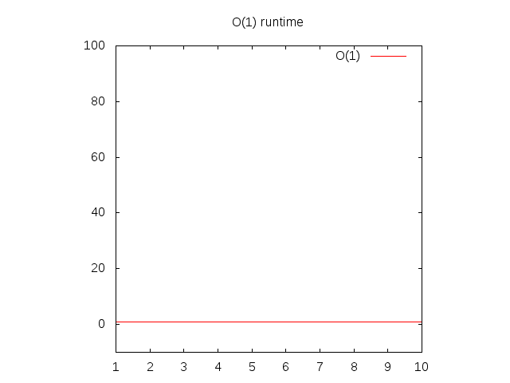
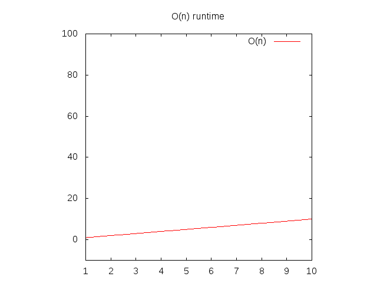
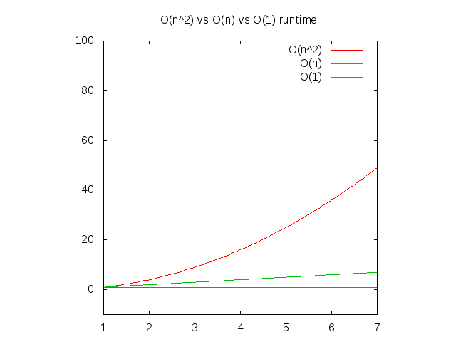

# Big-O-Notation

- Para ver la pagina [Click aquí](https://aleexzxzxzx.github.io/Big-O-Notation/)
## Qué son los algoritmos?

Los algoritmos son básicamente funciones.

Funciones que son algoritmos:

1. asimilar argumentos

2. devuelve explícitamente valores

#### 1.1 Ejemplo de un algoritmo

Algoritmo que cuenta el número de vocales en una palabra y devuelve el recuento:

```js
function countVowels(word) {
    var vowels = ['a', 'i', 'e', 'o', 'u'];
    var count = 0;
		for (var i = 0; i < word.length; i++) {
        for (var j = 0; j < vowels.length; j++) {
            if (word[i] === vowels[j]) {
                count++;
            }
        }
    }
    return count;
}

```

## Cuándo las funciones no son algoritmos?
Cuando escribe una función, puede o no puede

* tener argumentos

* devolver un valor

Las funciones que no toman argumentos o devuelven un valor generalmente se usan para secar código repetitivo, imprimir algo en la pantalla o servir como argumento para ejecutar más tarde. Estos tipos de funciones generalmente no se conocen como algoritmos.

#### 1.2 Ejemplo de una función que no es un algoritmo

Una función anónima que se pasa a la función de sondeo de jQuery. 

```js
$('button').on('click', function(){ 
	alert('hi') 
});
```

#### 1.3 Ejemplo de una función que no es un algoritmo

Esta función no tiene argumentos, no tiene retorno

```js
function clearDiv(){
	$('#div').html("");
}
```
#### 1.4 Ejemplo de una función que no es un algoritmo

Esta función tiene un argumento, pero no retorno

```js
function clearDiv(text){
	$('#div').text(text);
}
```

## Qué es Big O?

Big O es la abreviatura de Big O Notiation.

Big O es cómo los programadores hablan sobre la escalabilidad de los algoritmos.

La notación Big O de un algoritmo está determinada por el tiempo que tarda el algoritmo en devolver la salida en el escenario **peor de los casos**.

El término matemático para el **peor de los casos** es **"límite superior"**.

## Cómo dices O(n)

O(n) se lee como "Orden de N" o abreviatura de "O de N".

La función O es la función Orden.

## Por qué se llama Big O?

Porque estamos lidiando con órdenes de magnitud. ''Oe se utiliza porque la tasa de crecimiento de una función también se conoce como **"orden de la función"**.

## Por qué es importante Big O?

Comprender la Gran O de los algoritmos
* te mete en la mentalidad de codificar para la eficiencia. Ex: "Tengo que cambiar este algoritmo porque es O(n!)!"
* ayudarle a hablar de código con otros desarrolladores. Ex: "No te preocupes, cambié el algoritmo para que no sea O(n^2). Es O(n) ahora."
* ayudarle para entrevistas. Podrá hablar sobre la eficiencia de los algoritmos que tiene en la pizarra. Ex: "Lo que acabo de codificar es O(n^2)."

## Sumérgete en O(1)

#### Ejemplo 2.1

```js
function returnItem(item){
	return item;
}
```

`returnItem` es una función sin sentido, pero ten paciencia conmigo.

```js
returnItem(2);
```

`returnItem` Big O de Itemm es tiempo constante. No importa lo que pasemos a `returnItem`, el algoritmo pasará por una unidad de trabajo.

La "complejidad" de esta función es `O(1).`

Si desea graficar ongO(1) l, establecería y igual a 1 y lo graficaría.

**y = 1**



Observe que cuanto más a la derecha del eje horizontal (eje x) vaya, el eje vertical (eje y) permanece igual.

## Sumérgete en O(n)

#### Ejemplo 2.2
```js
function itemInList(check, list){
	for (var i = 0; i < list.length; i++){
		if (list[i] === check) return true;
	}
	return false;
}
```

Esto funcionará bastante rápido:

```js
itemInList(2, [1,2,3]);
```

La "complejidad" de `titemInListory` es `O(n)`.

Esto significa que es un gráfico lineal.

Para `itemInListory`, si la longitud de la matriz es 3; **peor caso** se necesitarán 3 unidades de trabajo.

Claro, en el mejor de los casos tomará 1 unidad de trabajo, pero Big O Notation no se trata del mejor de los casos, se trata del **peor de los casos**.

Si desea graficar `O(n)`, entonces reemplazaría el `n` con un `x` y lo establecería igual a `y`

**y = x**



Observe que cuanto más a la derecha del eje horizontal (eje x) vaya, el eje vertical (eje y) también sube.

## Sumérgete en O(n^2)

#### Ejemplo 2.3
```js
function allCombos(list){
	var results = [];
	for (var i = 0; i < results.length; i++){
		for (var j = 0; j < results.length; j++){
			results.push([i, j]);
		}
	}
}
```

Si lo hacemos `allCombos([1,2,3])` volveríamos `[(1,1) (1,2), (1,3), (2, 1), (2, 2), (2, 3), (3, 1), (3, 2), (3, 3)]` .

a "complejidad" de `allCombos` es `O(n^2)` .

La longitud del argumento de la lista de horallCombosamy es el 'gráfico en `O(n^2)`.

allCombos([1]) -> [[1,1]]. Una unidad de trabajo. 1^2 = 1 allCombos([1,2]) -> [[1,1], [1,2], [2,1], [2,2]]. Cuatro unidades de trabajo. 2^2 = 4

Entonces n * n es n^2.

## Comparación de O(1), O(n), O(n^2)

Observe que cuanto más a la derecha del eje horizontal (eje x) vaya, el eje vertical (eje y) sube más rápido para `O(n^2)` , más lento para `O(n)` y constante para `O(1)` .

Esto significa que `O(n^2)` corre más lento que `O(n)`, que corre más lento que `O(1)`.



## O(1) vs O(n) vs O(n^2) explicado sin código

#### O(1)
Piensa en la suma de números de un solo dígito con lápiz y papel. La clase de suma que aprendiste cuando eras joven.

```
5 + 5 = 10

3 + 3 = 6

2 + 2 = 4

2 + 3 = 5

6 + 7 = 13
```

Cada uno de esos diferentes problemas requirió la misma cantidad de operaciones para completarse (o la misma cantidad de unidades de trabajo para completarse). Tomas un número y lo sumas a otro. Listo.

Debido a que siempre se trata de las mismas unidades de trabajo a completar, sin importar cuál sea el problema, el gran O es constante, este es un ejemplo de "O(1)".

#### O(n)

Considere la suma de varios dígitos con lápiz y papel.

```
55 + 72 = 127

455 + 322 = 777

1234 + 4447 = 5681

4999 + 56 = 5055
```

Observe cómo el número de operaciones (o la cantidad de unidades de trabajo a completar) aumenta a medida que aumenta el número de dígitos.

El número de operaciones se correlaciona directamente (son uno a uno) con el número de dígitos del número más grande que se suma.

Esto requeriría, en el peor de los casos, `O(n)` unidades de trabajo.

#### O(n^2)

Ahora, consideremos la multiplicación de varios dígitos con lápiz y papel.

```
55538 * 92338 = 5128267844
```

Esto es mucho más difícil de hacer que las dos peticiones anteriores.

Cada dígito del número inferior debe multiplicarse por cada dígito del número superior.

Si tuvieras que multiplicar números de 100 dígitos entre sí, se necesitarían 10 000 operaciones matemáticas para completarlas (unidades de trabajo para completarlas).

Esto requeriría, en el peor de los casos, `O(n^2)` unidades de trabajo para completarse.

## Sumerjámonos en O(log(n))

O(1) < O(log(n)) < O(n) < O(n^2)


#### ¿Cómo se ve un algoritmo que tiene un O grande de O(log(n))?

La elección del siguiente elemento sobre el que realizar alguna acción es una de varias posibilidades, y sólo será necesario elegir una.

#### Por ejemplo, buscar personas en una guía telefónica es O(log(n))

No es necesario consultar a cada persona en la guía telefónica para encontrar la correcta; en lugar de eso, puedes simplemente dividir y conquistar, y solo necesitas explorar una pequeña fracción de todo el espacio antes de finalmente encontrar el número de teléfono de alguien.

Por supuesto, una guía telefónica más grande todavía le llevará más tiempo, pero no crecerá tan rápido como el aumento proporcional del tamaño adicional.

#### Ej. un algoritmo que tiene un O grande de O(log(n))

```js
función dosDivide(x){
	recuento de variables = 0;
	mientras (parseInt(x) > 1) {
		x = x / 2;
		contar = contar + 1;
	}
	recuento de retorno;
}
```
##### Calculando el Big O del algoritmo anterior

**sin matemáticas**

A menudo no se necesitan matemáticas para averiguar cuál es el Big-O de un algoritmo. Simplemente se puede usar la intuición.

Observa cuántas unidades de trabajo tiene que realizar el algoritmo a medida que crece la entrada y haz coincidir eso con el Big O correcto.

Sin contar el retorno ni la declaración de variable:  
twoDivides(2) = 1. Las operaciones para cada paso del bucle serían x = 2/1 (para la división) y count = 0 + 1 (para el conteo); por lo que 2 en total.  
twoDivides(4) = 2. Las operaciones serían `x = 4/2` y `count = 0 + 1`, `2/1` y `1 + 1`; por lo que 4 en total.  
twoDivides(8) = 3. Las operaciones serían `x = 8/2` y `count = 0 + 1`, `4/2` y `1 + 1`, `2/2` y `2 + 1`; así que 6 en total.  
twoDivides(16) = 4. Las operaciones serían `x = 16/2` y `count = 0 + 1`, `8/2` y `1 + 1`, `4/2` y `2 + 1`, `2/2` y `3 + 1`, por lo que 8 en total.  
twoDivides(32) = 5. Las operaciones serían `x = 32/2` y `count = 0 + 1`, `16/2` y `1 + 1`, `8/2` y `2 + 1`, `4/2` y `3 + 1`, `2/2` y `4 + 1`; así que 10 en total.  

La "complejidad" de twoDivides es "O(log(n))".  

n | operaciones
-----|---------------
2 | 2
4 | 4
8 | 6
16 | 8
32 | 10
... | ...
n | 2 * log(n)

`log(n)` aquí significa esencialmente "el número de veces que podemos dividir `n` por 2".

**Nota al margen:** Al escribir la notación Big O, se ignora el "2" inicial, ya que no cambia significativamente el comportamiento asintótico de la función para valores grandes de `n`. Por lo tanto, podemos ver que `O(2 * log(n))` es equivalente a `O(log(n))`. En general, al escribir la notación Big O solo se tiene en cuenta la parte más significativa de la complejidad (incluso `2n^2 + 2n` se escribiría como `O(n^2)`).
    
En este caso (`log(n)`), el tamaño del número es `n`. Podemos ver que el número de operaciones no es constante, pero no crece linealmente (y crece más lentamente a medida que `n` aumenta).

**caso general, con matemáticas**

Iteración | x
----------|--------
0 | x (esto es lo mismo que x/1)
1 | x/2
2 | x/4
... | ...
k         |  x/2^k 

2^k = x → Aplicando logaritmo a ambos lados → k = log(x)

log(2^k) = log(x)

k*log(2) = log(x)

k = log(x)/log(2)

k es aproximadamente igual a log(x)

## Profundicemos en O(n log n)

O(1) < O(log(n)) < O(n) < O(n log(n)) < O(n^2)

``js
// supongamos que n es un entero
función nlogn(n){
	var resultados = [];
	for (var i = 0; i < n; i++){ // este bucle se ejecuta n veces, por lo que O(n)
	    for (var j = n; j > 0; j = parseInt(j/2)){ // este bucle se ejecuta log(n) veces, por lo que O(logn)
	    	resultados.push(j);
	    }
	}
	devolver resultados;
}
```

Para los bucles for adyacentes, debe sumar los tiempos de ejecución, por ejemplo, "O(n + m)". Para los bucles for anidados, debe multiplicarlos, por ejemplo, "O(n*m)" o, en este caso, "O(nlogn)".

Esto daría como resultado

```
nlog(3)
[3, 1, 3, 1, 3, 1]
```

```
nlogn(4)
[4, 2, 1, 4, 2, 1, 4, 2, 1, 4, 2, 1]
```

## Sumerjámonos en O(2^n)

Los algoritmos con un Big O de 2^n suelen ser recursivos.

```js
// assume number is an integer
function fib(number) {
 if (number <= 1) return number;
 return fib(number - 2) + fib(number - 1);
}
```

`O(2^n)` ocurre cuando un problema de tamaño `n` requiere resolver dos problemas más pequeños de tamaño `n-1` (en Fibonacci esto es casi cierto, son solo dos problemas, uno de tamaño `n-1` y el otro de tamaño `n-2`. En esencia, estás duplicando la cantidad de problemas que necesitas resolver cada vez que n aumenta.

Supongamos que nuestro algoritmo requiere dos operaciones y que para resolver un problema de tamaño `n` se necesitan dos problemas de tamaño `n-1`. Entonces, la cantidad de operaciones para valores crecientes de `n` son:

norte | operaciones(n)
--- | ---
1 | 2
2 | 4 = 2 + 2 = operaciones(2-1) + operaciones(2-1) = 2(2) = 2^2
3 | 8 = 4 + 4 = operaciones(3-1) + operaciones(3-1) = 2(4) = 2(2^2)= 2^3
4 | 16 = 8 + 8 = operaciones(4-1) + operaciones(4-1) = 2(8) = 2(2^3) = 2^4
...
k | (k-1) + (k-1) = 2(k-1) = 2((k-2) + (k-2)) = 4(k-2) = 8(k-3) = ... = 2^(k-1)(2) = 2^k

## ¡Sumérgete en O(n!)

Cualquier algoritmo que calcule todas las permutaciones de una matriz dada es `O(n!)`. El factorial es el número que se obtiene si se multiplican todos los números desde 1 hasta `n`.

Imagina que tienes una serie de palabras y quieres devolver todas las combinaciones posibles de esas palabras.

Así que dado
```
['manzana', 'oso', 'limp bizkit']
```

El algoritmo devolvería una matriz de 6 matrices, como esta:
```
[
	['manzana', 'oso', 'limp bizkit'],
	['manzana', 'limp bizkit', 'oso'],
	['oso', 'limp bizkit', 'manzana'],
	['oso', 'manzana', 'limp bizkit'],
	['limp bizkit', 'oso', 'manzana'],
	['limp bizkit', 'manzana', 'oso'],
]
```
Escribir un algoritmo que hiciera eso sería `O(n!)`. `n` aquí es la longitud de la matriz, entonces 3! = 3 * 2 * 1 = 6.

Otro ejemplo:

```js
// supongamos que n es un entero
función nFactorial(n) {
  para (var i = 0; i < n; i++) {
    devuelve nFactorial(n - 1);
  }
}
```

Esto ejecuta la función `nFactorial` `n-1` veces para una entrada `n`. Por lo tanto, se obtiene `n*nFactorial(n-1)`.

`n*f(n-1) = n*(n-1)*f(n-2) = ... = n*(n-1)*(n-2)*...*1*f(1) = n!`.

## Big O puede ser engañoso

La notación Big-O es una estimación y solo es útil para valores grandes de n.

#### ordenación por inserción vs ordenación por combinación

El tiempo de ejecución en el peor de los casos para el **algoritmo de ordenamiento por inserción es O(n^2)**.

En comparación con Big O, esto es peor que el tiempo de ejecución de **ordenación por fusión, que es O(n log n)**.

Pero para pequeñas cantidades de datos (cuando n es pequeño), la ordenación por inserción es en realidad más rápida, ¡especialmente si la matriz ya está parcialmente ordenada!

Big O es útil cuando se comparan dos algoritmos para determinar cuál se ejecuta más rápido cuando n es grande.

Si la cantidad de datos (n) es relativamente pequeña, entonces incluso un algoritmo lento será lo suficientemente rápido para el uso práctico.

#### Otras preocupaciones

El tiempo de ejecución promedio de los algoritmos puede variar significativamente para diferentes entradas, pero la notación Big O solo indica el peor escenario posible. Por lo tanto, puede haber un algoritmo que ejecute `logn` en el 99 % de los casos, pero que el 1 % del tiempo tarde `n!` tiempo, y otro que resuelva el mismo problema pero que siempre ejecute `n^2`. Por lo tanto, la notación Big O no ofrece una imagen completa de la eficiencia del tiempo de ejecución. Esto es particularmente notable cuando se observan algoritmos de resolución, que tienen diferentes tiempos de ejecución en el mejor, peor y promedio de los casos. Sin embargo, la mayoría de las discusiones en torno al análisis del tiempo de ejecución se centran en Big O y el tiempo de ejecución en el peor de los casos.

## Otras categorías de Big O de la más rápida a la más lenta

Big-O | Nombre | Descripción
------| ---- | -----------
**O(1)** | constante | **Esta es la mejor opción.** El algoritmo siempre tarda la misma cantidad de tiempo, independientemente de la cantidad de datos que haya. En otras palabras, la cantidad de unidades de trabajo que tarda el algoritmo en completarse es independiente del tamaño de la entrada. Ejemplo: buscar un elemento de una matriz por su índice.
**O(log n)** | logarítmico | **Muy bueno.** Este tipo de algoritmos eliminan un porcentaje de la cantidad de datos que se deben analizar en cada iteración. Si tienes 100 elementos, se necesitan aproximadamente 7 pasos para encontrar la respuesta. Con 1000 elementos, se necesitan 10 pasos. Y con 1 000 000 de elementos, solo se necesitan 20 pasos. Esto es muy rápido incluso para grandes cantidades de datos. Ejemplo: búsqueda binaria (búsqueda de matriz ordenada).
**O(n)** | lineal | **Buen rendimiento.** Si tiene 100 elementos, esto realiza 100 unidades de trabajo. Este suele ser el caso de un bucle. Si duplica el tamaño de n, entonces el algoritmo realiza 2 * n unidades de trabajo. Ejemplo: búsqueda en una matriz no ordenada.
**O(n log n)** | "linearítmico" | **Rendimiento aceptable.** Es un poco peor que el lineal, pero no demasiado malo. Ejemplo: mergesort y otros algoritmos de ordenamiento "rápidos".
**O(n^2)** | cuadrático | **Un poco lento.** Si tienes 100 elementos, esto hace 100^2 = 10 000 unidades de trabajo. Duplicar la cantidad de elementos lo hace cuatro veces más lento (porque 2 al cuadrado es igual a 4). Ejemplo: un bucle for doble -> tienes que mirar cada par de elementos de entrada.
**O(n^3)** | cúbico | **Rendimiento deficiente.** Si tiene 100 elementos, esto realiza 100^3 = 1.000.000 de unidades de trabajo. Duplicar el tamaño de entrada lo hace ocho veces más lento. Ejemplo: multiplicación de matrices. O bien, está mirando cada par de entradas, pero la operación que realiza requiere mirar todas las entradas nuevamente
**O(2^n)** | exponencial | **Rendimiento muy deficiente.** Es conveniente evitar este tipo de algoritmos, pero a veces no hay otra opción. Añadir un solo bit a la entrada duplica el tiempo de ejecución. Ejemplo: adivinar por fuerza bruta los resultados de una secuencia de `n` lanzamientos de moneda.
**O(n!)** | factorial | **Intolerablemente lento.** Literalmente, se necesitan un millón de años para hacer cualquier cosa. Ejemplo: debes considerar cada subconjunto posible de tus entradas. Observa el problema del viajante de comercio: la solución forzada es `n!`.


## otro gráfico

Big-O | cálculos para 10 cosas | cálculos para 100 cosas
------| ---- | -----------
O(1) | 1 | 1
O(log(n)) | 3 | 7
O(n) | 10 | 100
O(n Iniciar sesión(n)) | 30 | 700
O(n^2) | 100 | 10000
O(n^3) | 1000 | 1000000
O(2^n) | 1024 | 2^100
O(n!) | 3628800 | 100! -> matemáticamente este es el producto de (100 * 99 * 98...)

## y otro

norte | calma | norte | nlogn | norte^2 | 2^norte | ¡No!
--- | --- |--- | --- |--- | --- | ---
1 | 0 | 1 | 0 | 2 | 2 | 1
2 | 3.69 | 2 | 1.4 | 4 | 4 | 2
3 | 1.1 | 3 | 3.3 | 9 | 8 | 6
4 | 1.4 | 4 | 5.5 | 16 | 16 | 24
5 | 1.6 | 5 | 8 | 25 | 32 | 120
10 | 2.3 | 10 | 23 | 100 | 1024| 3628800


## Examen sorpresa

¿Cuál es el gran O de cada uno de estos algoritmos?

a)

```js
función countUpA(n){
	recuento de variables = 0;
    para (var i = 1; i <= n; i++) {
        para (var j = n; j > 1; j--) {
            para (var k = 1; k < n; k = k + 2) {
                contar++;
            }
        }
    }
    recuento de retorno;
}

```

b)
```js
función countUpB(n){
	recuento de variables = 0;
	para (var i = 1; i <= n; i++) {
	    para (var j = n; j > 1; j--) {
	        para (var k = 1; k < 1000; k = k + 2) {
	            contar++;
	        }
	    }
	}
	recuento de retorno;
}

```

C)
```js
función countUpC(n){
	recuento de var = n;
	para (var i = 1; i <= 1000000; i++) {
	    para (var j = i; j > 500; j--) {
	        para (var k = 1; k < 10500; k = k + 2) {
	            contar++;
	        }
	    }
	}

	recuento de retorno;
}

```
d)

```js
función countUp(n){
	recuento de variables = 0;
	donde j = 1;
	para (var i = 1; i < n; i++) {
        mientras (j < n) {
            j++;
            contar++;
        }
        j = 1;
	}
	recuento de retorno;
}

```

e)

```js
función countUpE(n){
	recuento de variables = 0;
	var i = n;
	mientras (i > 1){
	    contar++;
	    yo = yo / 2;
	}
	recuento de retorno;
}

```


## Respuestas al cuestionario

a) O(n^3)

bucles triples for, a medida que la entrada crece, las unidades de trabajo crecen a un ritmo cúbico.

b) O(n^2)

bucles triples, pero solo 2 de los bucles aumentan las unidades de trabajo con respecto a la entrada

c) O(1)

A medida que aumenta la entrada, las unidades de trabajo siempre permanecen iguales.

d) O(n^2)

A medida que aumenta la entrada, las unidades de trabajo aumentan a un ritmo cuadrático.

e) O(log n)

A medida que aumenta la entrada, las unidades de trabajo aumentan, pero no a un ritmo lineal o cuadrático.


## Recursos utilizados

Explicaciones:
https://justin.abrah.ms/computer-science/explicacion-de-la-notacion-big-o.html
http://stackoverflow.com/questions/107165/big-o-for-eight-year-olds?rq=1

Ejemplos de códigos reelaborados desde aquí:
Ejemplo de código de Big Ologn: http://stackoverflow.com/questions/17122807/big-o-ologn-code
http://stackoverflow.com/questions/19021150/gran-oh-para-n-log-n

Gráficos utilizados:
https://github.com/raywenderlich/swift-algorithm-club/blob/master/Big-O%20Notation.markdown
https://www.quora.com/¿Cómo le explicarías O-log-n-en-algoritmos a un estudiante de primer año de licenciatura?


http://www.daveperrett.com/articles/2010/12/07/comp-sci-101-big-o-notation/

Examen sorpresa:
http://stackoverflow.com/questions/9223351/confused-on-big-o-notation?rq=1

Versión en ingles:
https://github.com/pavankat/big-o-in-plain-english/tree/master
